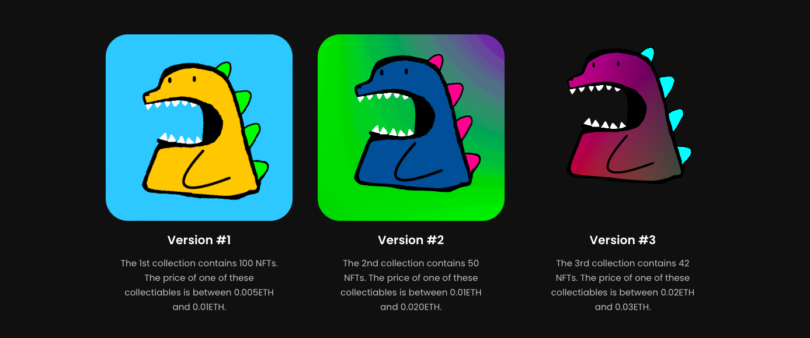

# AnxiousDino Project

**Note:** *This is just a hobby project I worked on during my university time.*

## Project Overview

The AnxiousDino project is a result of my passion for exploring the intersection of technology and creativity. Originally developed as a hobby project during my university years, it served as the foundation for the website behind AnxiousDino.com.

## About AnxiousDino.com

AnxiousDino.com was a Danish NFT (Non-Fungible Token) project built on the Binance Smart Chain. The project aimed to bring together the vibrant world of blockchain technology and unique digital art. NFTs, as a form of digital asset, gained popularity for their ability to represent ownership of digital content, and AnxiousDino.com sought to contribute to this emerging space.

## Features and Technologies - Not Integrated

- **Blockchain Integration:** Leveraging the Binance Smart Chain, the project incorporated blockchain technology to ensure transparent and secure transactions for NFTs.

- **Digital Art Marketplace:** AnxiousDino.com provided a platform for artists and creators to showcase and sell their digital artwork as NFTs.

- **User Profiles and Wallet Integration:** Users could create profiles, manage their digital wallets, and engage with the NFT marketplace seamlessly.

## Development Context

This project was born out of a desire to experiment with blockchain technology and create a space for artists to showcase their talent in the digital realm. While it started as a personal endeavor, the experience gained during its development became a valuable part of my academic journey.

## Future Developments

While the initial development phase was focused on creating a functional NFT platform, future plans for the project may include additional features, improvements, and adaptations based on community feedback and evolving trends in the blockchain space.

Feel free to explore the project and its codebase to gain insights into the integration of blockchain technology with web development and the creation of a digital art marketplace.

